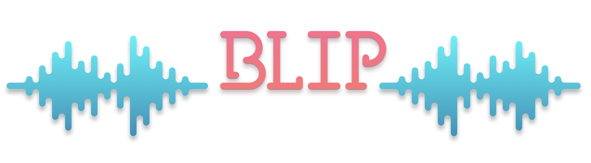

# Blip
Blip is a library to procedurally generate and play sound effects for games. The library is based on the [Sfxr](https://github.com/grimfang4/sfxr) project by [Dr.Petter](http://www.drpetter.se/).


# Installation
You can use Blip in your own project by adding this project as a [Defold library dependency](http://www.defold.com/manuals/libraries/). Open your game.project file and in the dependencies field under project add:

https://github.com/britzl/blip/archive/master.zip

Or point to the ZIP file of a [specific release](https://github.com/britzl/blip/releases).


# Usage
You generate a sound by calling one of the predefined sound effect groups:

```
local seed = 1234
local wav = blip.explosion(seed)
```

This will generate a sound effect as a WAV sample using the specified seed. The seed is a number that is used to generate a specific version of the sound effect. Passing in a certain seed will always result in the same sound. Use the [example app](example/) to find seeds that you like and use them in your own project.

Once you have a sound effect that you like you set it on an existing sound component and play the sound:

```
-- set the sound data on the sound component #sound
local resource_path = go.get("#sound", "sound")
resource.set_sound(resource_path, wav)

-- play the sound
sound.play("#sound")
```


# Try it!
Try the [HTML5 version of the example app](https://britzl.github.io/Blip/).
